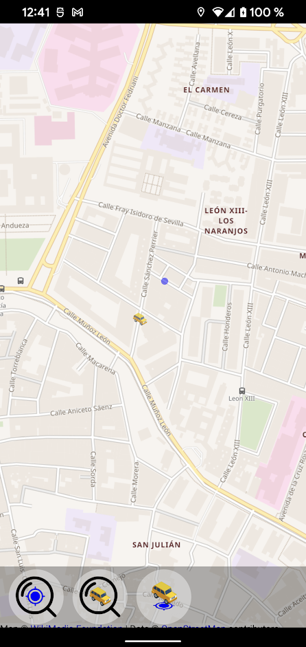

# Where Is My Car App

Simple Qt Application project to save and get the location of your car on the map:

    

Simple but useful functions in case, like me, you don't have a modern car:
* Load map information from [OpenStreetMap](https://www.openstreetmap.org/#map=6/40.007/-2.488).
* Show your current location.
* Allow you to save your car location manually or setting it to your (device) current location.

## Get it in your Android Device

Download the last version of this App: 

Install it accepting all the security questions (or not, that's up to you :innocent:).

## Dependencies

* [Qt + QtCreator](https://www.qt.io/download). Created using **Qt 5.15.2**
* In case of you are using Android, continue to [this document](docs/HowtoQtAndroid.md) to build and test the project in a real or virtual android device and/or generate the APK.

## Usage

In Linux, just open the project file [where_is_my_car.pro](where_is_my_car.pro) using **QtCreator**, configure the project using the default settings, compile and play it.

In Android, check [this document](docs/HowtoQtAndroid.md) to know how to run/install it on you real smartphone or in a virtual android device.
